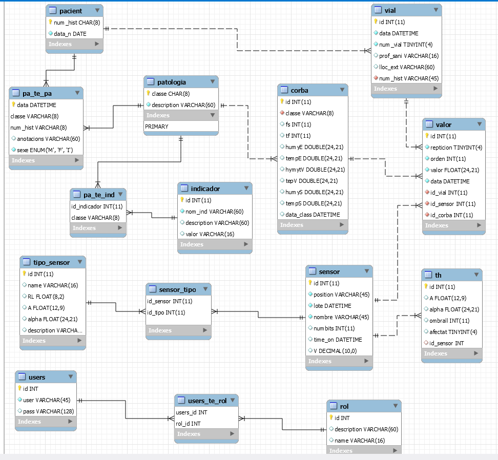

# Base de datos para el almacenamiento y necesidades de los aplicativos

En el proyecto se encuentra el script sql para la creación o actualización de la base de datos.
se ha generado sobre el servidor de bases de datos mariadb.

